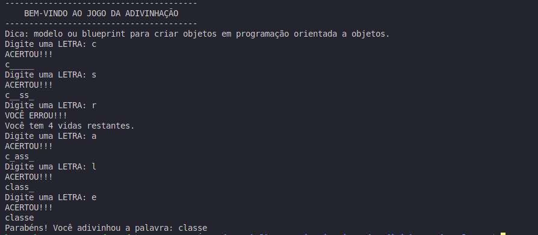

## Descrição

Este é um jogo simples de adivinhação de palavras desenvolvido na disciplina Técnicas de Programação. O jogo seleciona aleatoriamente uma palavra relacionada à programação e exibe uma dica para o jogador. O objetivo é adivinhar a palavra digitando letras antes que todas as vidas se esgotem.

## 📌 Índice

- [Tecnologias Utilizadas](#tecnologias-utilizadas )
- [Funcionalidades](#funcionalidades)
- [Como Jogar](#como-jogar)
- [Como Executar](#como-executar)
- [Imagem da tela do jogo](#imagem-da-tela-do-jogo)


## 🛠️ Tecnologias Utilizadas 

- Python 3

- Biblioteca random (para seleção aleatória da palavra)

## ⚙️ Funcionalidades 

- Seleção aleatória de uma palavra relacionada à programação.

- Exibição de uma dica sobre a palavra escolhida.

- O jogador pode tentar adivinhar a palavra digitando uma letra por vez.

- O jogo informa se a letra digitada está ou não na palavra.

- O jogador tem 5 vidas para tentar adivinhar a palavra.

- O jogo termina quando o jogador acerta a palavra ou perde todas as vidas.


## 🎮 Como Jogar 

1. Execute o programa Python.

2. O jogo mostrará uma dica sobre a palavra oculta.

3. Digite uma letra e pressione Enter.

4. Se a letra estiver na palavra, será revelada. Caso contrário, você perderá uma vida.

5. Continue tentando até adivinhar a palavra ou perder todas as vidas.

## 🚀 Como Executar 

1. Certifique-se de ter o Python 3 instalado no seu sistema.

2. Clone o repositório ou copie o código do jogo e colo em um IDE online.

3. No terminal ou prompt de comando, navegue até o diretório onde o arquivo do jogo está salvo.

4. Execute o seguinte comando:
    ```bash
    python3 jogo.py
    ```
5. Siga as instruções na tela para jogar.

## 📷 Imagem da tela do jogo
 

## 👨‍💻  Autor 

Desenvolvido por Keven Costa para a disciplina de Técnicas de Programação.